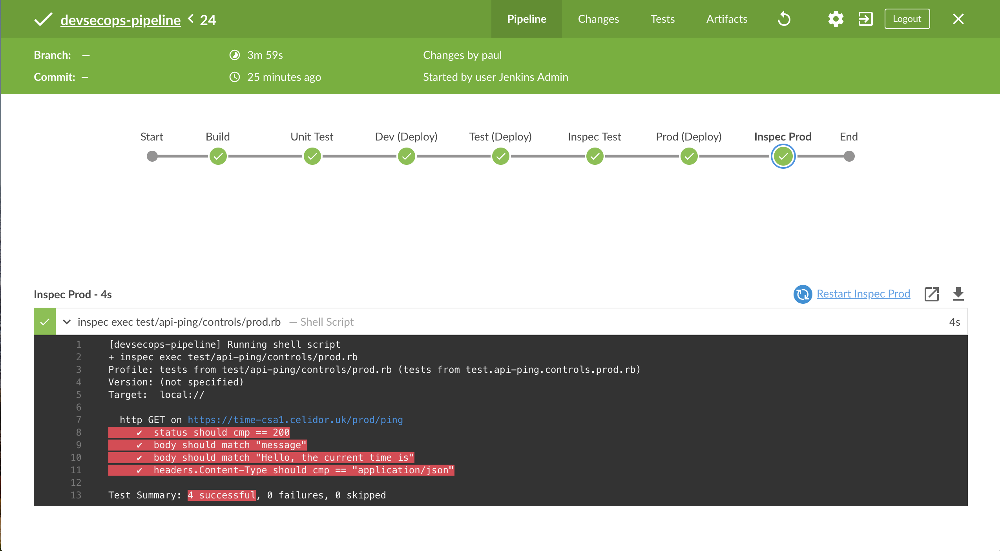

# devsecops-pipeline

Deploy serverless function with custom domain and Inspec test:

* create a Jenkins server in AWS using https://github.com/celidor/devsecops-jenkins
* create a SCM pipeline pointing to this repository
* run the pipeline

Stages:

* build
* unit test
* dev deploy
* create test custom domain
* test deploy
* inspec test
* create prod custom domain
* prod deploy
* inspec prod

